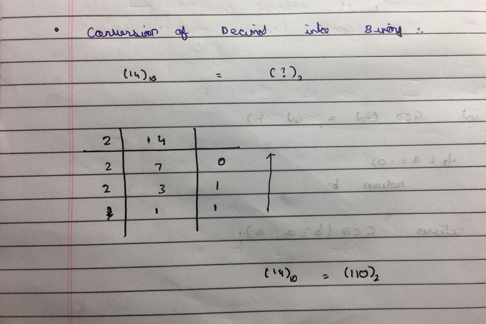
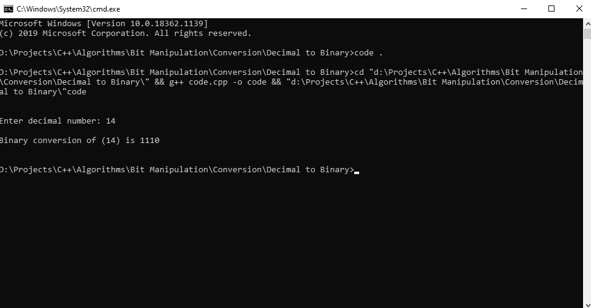

# Decimal to Binary convertor

## Logic behind the decimal-to-binary conversion

We need to iterate the number by dividing it by 2 everytime and storing the remainder after every calculation (Until we reach 1). After the completion we get the binary code for the decimal number by traversing the calculated remainders in reverse order. The image explains the entire process with an example.

## Output for the code

## Libraries Used

>#include "iostream"
###
>#include "stack"

### Thanks For Reading
